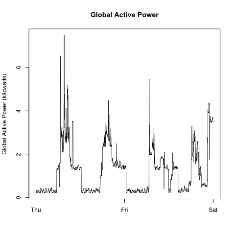
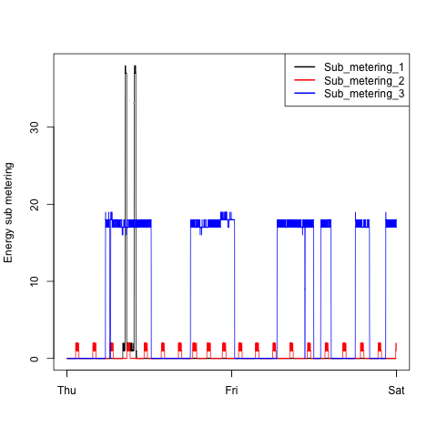
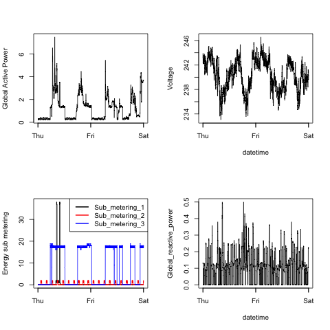

## Course Project

This assignment uses data from
the <a href="http://archive.ics.uci.edu/ml/">UC Irvine Machine
Learning Repository</a>, a popular repository for machine learning
datasets. In particular, we will be using the "Individual household
electric power consumption Data Set" which I have made available on
the course web site:

* <b>Dataset</b>: <a href="https://d396qusza40orc.cloudfront.net/exdata%2Fdata%2Fhousehold_power_consumption.zip">Electric power consumption</a> [20Mb]

* <b>Description</b>: Measurements of electric power consumption in
one household with a one-minute sampling rate over a period of almost
4 years. Different electrical quantities and some sub-metering values
are available.

## Loading the data

The dataset has 2,075,259 rows and 9 columns. First
calculate a rough estimate of how much memory the dataset will require
in memory before reading into R. Make sure your computer has enough
memory (most modern computers should be fine).

    # Assuming first 2 date columns (each 312 bytes) and the other 7 numeric columns (each 48 bytes)

    # Memory estimate is about 2 GB
    > (2075259 * 2) * 312 + (2075259 * 7) * 48
    [1] 1992248640

We will only be using data from the dates 2007-02-01 and
2007-02-02. One alternative is to read the data from just those dates
rather than reading in the entire dataset and subsetting to those
dates.

    # We subset the data for the specified dates from the Linux or Mac OSX terminal:

    # Extract the headers
    $ cat household_power_consumption.txt | head -n 1 > subset_household_power_consumption.txt

    # Select the dates
    $ cat household_power_consumption.txt | grep "^[12]/2/2007" >> subset_household_power_consumption.txt

You may find it useful to convert the Date and Time variables to
Date/Time classes in R using the `strptime()` and `as.Date()`
functions.

Note that in this dataset missing values are coded as `?`.

    # Load and process data

    PowerConsumption <- read.csv("subset_household_power_consumption.txt",
                                na.strings = "?",
                                sep = ";",
                                stringsAsFactors = FALSE)

    Datetime <- strptime(paste(PowerConsumption$Date, PowerConsumption$Time), format = "%d/%m/%Y %H:%M:%S")
    PowerConsumption <- cbind(Datetime, PowerConsumption)

## Plots

### Plot 1

### Plot 2

### Plot 3

### Plot 4

